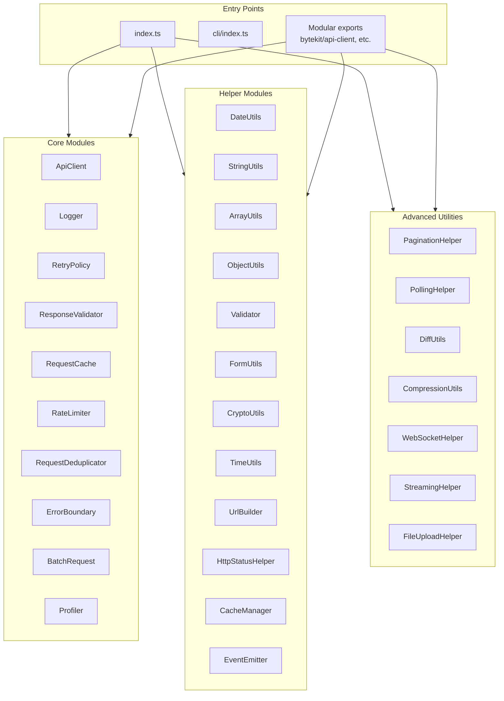
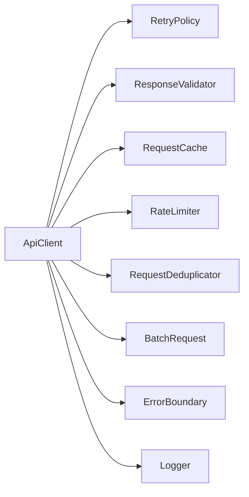

# Bytekit Architecture

> Este documento describe la arquitectura técnica del proyecto.

## 📦 Module Architecture



## 🏗️ Core Module Dependencies

### ApiClient (Central HTTP Module)



**Key Features:**
- Typed HTTP client with generic response types
- Automatic retry with exponential backoff
- Circuit breaker pattern
- Request deduplication
- Response caching
- Rate limiting
- Localized error messages (ES/EN)

### Logger

- Structured logging with levels (debug, info, warn, error)
- Namespace support for filtering
- Multiple transports (console, custom)
- Metadata support

## 📂 File Conventions

### Source Files (`src/`)

| Pattern | Description | Example |
|---------|-------------|---------|
| `utils/core/*.ts` | Core functionality | `ApiClient.ts`, `Logger.ts` |
| `utils/helpers/*.ts` | Utility helpers | `DateUtils.ts`, `StringUtils.ts` |
| `{module}.ts` (root) | Re-export files | `api-client.ts` → exports `./utils/core/ApiClient` |
| `index.ts` | Barrel exports | Aggregates all exports |

### Test Files (`tests/`)

| Pattern | Description |
|---------|-------------|
| `{module}.test.js` | Test file for module |
| `setup.ts` | Test setup/mocks |

## 🔌 Export Strategy

The package uses conditional exports in `package.json`:

```json
{
  "exports": {
    ".": "./dist/index.js",
    "./api-client": "./dist/utils/core/ApiClient.js",
    "./date-utils": "./dist/utils/helpers/DateUtils.js"
    // ... more modular exports
  }
}
```

**Benefits:**
- Tree-shaking support
- Smaller bundle sizes when using modular imports
- TypeScript types included via `.d.ts` files

## 🧩 Type System

### Strict TypeScript Configuration

```typescript
// All strict checks enabled
{
  "strict": true,
  "noImplicitAny": true,
  "strictNullChecks": true,
  "strictFunctionTypes": true,
  "strictBindCallApply": true,
  "strictPropertyInitialization": true,
  "noImplicitThis": true,
  "noImplicitReturns": true
}
```

### Common Type Patterns

```typescript
// Generic response typing
interface ApiResponse<T> {
  data: T;
  status: number;
  headers: Headers;
}

// Options pattern
interface ApiClientOptions {
  baseUrl: string;
  defaultHeaders?: Record<string, string>;
  retryPolicy?: RetryPolicyOptions;
  locale?: 'en' | 'es';
}

// Utility result types
type AsyncResult<T> = Promise<T>;
type MaybePromise<T> = T | Promise<T>;
```

## 🌍 Isomorphic Compatibility

All modules check the runtime environment:

```typescript
// Environment detection pattern
const isBrowser = typeof window !== 'undefined';
const isNode = typeof process !== 'undefined' && process.versions?.node;

// Conditional implementations
const storage = isBrowser ? localStorage : new Map();
```

## 📊 Module Size Reference

| Module | Size (TS) | Purpose |
|--------|-----------|---------|
| ApiClient.ts | ~16KB | HTTP client |
| FormUtils.ts | ~15KB | Form handling |
| ErrorBoundary.ts | ~14KB | Error management |
| ObjectUtils.ts | ~11KB | Object utilities |
| DiffUtils.ts | ~9KB | Diff algorithms |
| StringUtils.ts | ~9KB | String utilities |
| TimeUtils.ts | ~9KB | Time utilities |
| ArrayUtils.ts | ~9KB | Array utilities |
| CryptoUtils.ts | ~8KB | Crypto utilities |
| CacheManager.ts | ~7KB | Cache management |
