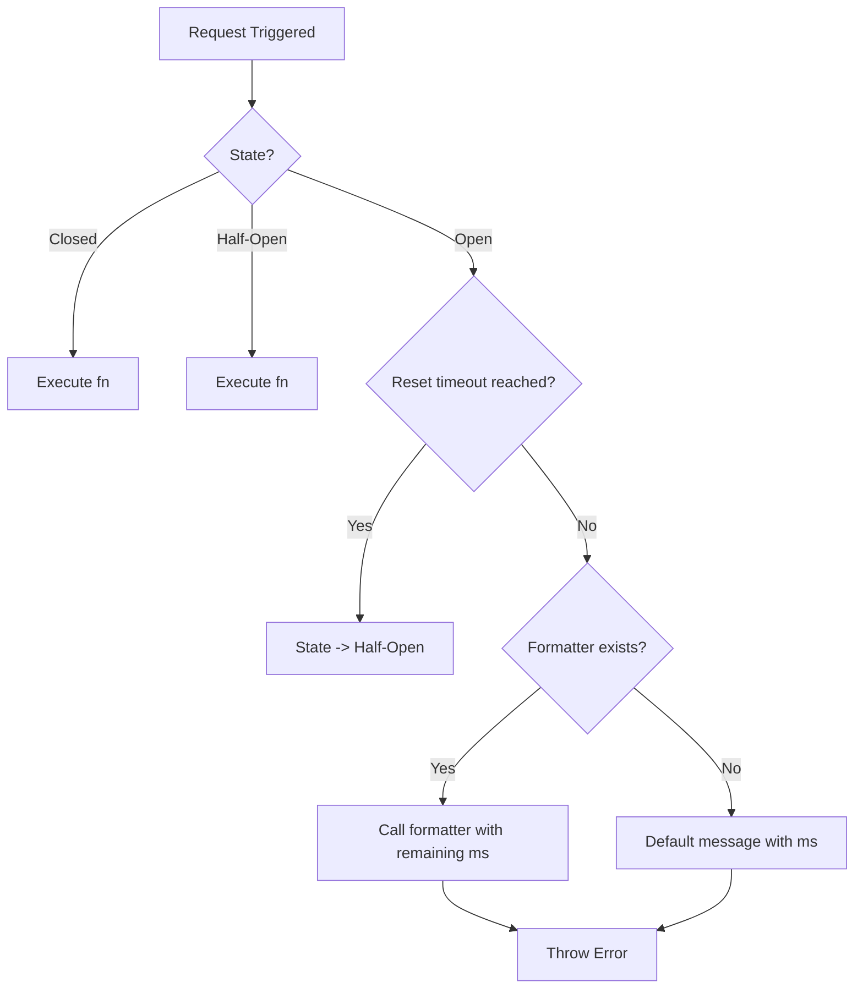

# Data Model: Customize Circuit Breaker Error Message

## CircuitBreakerConfig Refinement

The `CircuitBreakerConfig` interface is updated to support custom error messaging.

### Properties

| Name                    | Type                     | Description                                 | Required | Default     |
| ----------------------- | ------------------------ | ------------------------------------------- | -------- | ----------- |
| `failureThreshold`      | `number`                 | Number of failures before opening           | No       | `5`         |
| `successThreshold`      | `number`                 | Number of successes before closing          | No       | `2`         |
| `timeoutMs`             | `number`                 | Time to wait before transition to half-open | No       | `60000`     |
| `errorMessageFormatter` | `(ms: number) => string` | Function to format the "open" error message | No       | `undefined` |

## State Transitions

No changes to the state machine itself, only to the error production when in the `open` state.

### Error Production Logic

